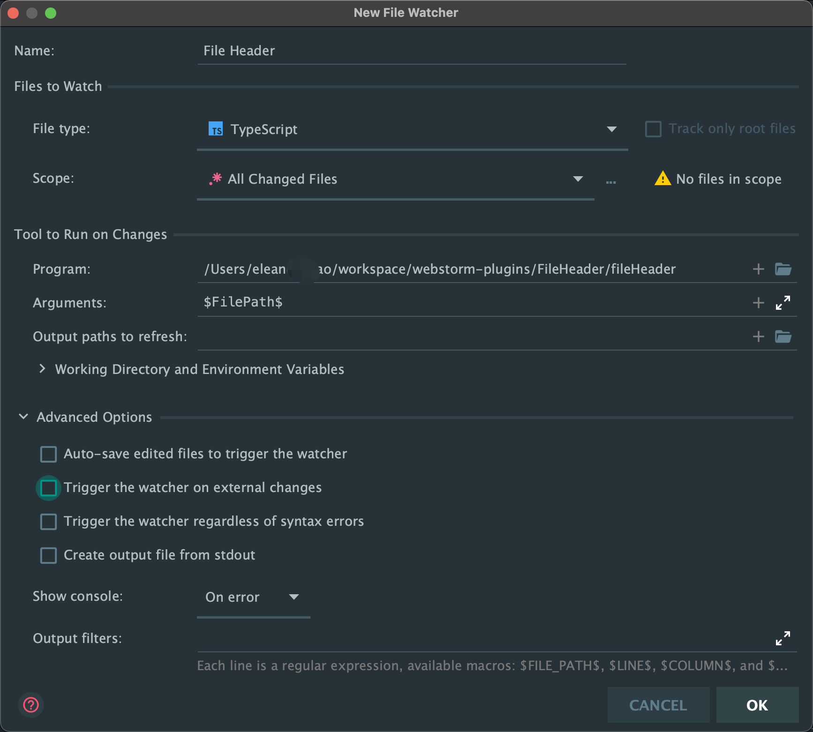

# File Header 

Use with the `File and Code Templates`, dynamically update your `LastEditTime` in file header comment

Reference to [vscode-fileheader](https://github.com/zhaopengme/vscode-fileheader/blob/master/extension.js)

# Getting started

## 1. add file template

open the `Settings/Preferences | Editor | File and Code Templates` and add your file header comment.

eg.

```javascript
/*
 * @Author       : Eleanor Mao
 * @Date         : ${YEAR}-${MONTH}-${DAY} ${HOUR}:${MINUTE}:${SECOND}
 * @LastEditTime : ${YEAR}-${MONTH}-${DAY} ${HOUR}:${MINUTE}:${SECOND}
 */
```

## 2. add FileHeader to `File Watchers`

open the `Settings/Preferences| Tools | File Watchers`, and add a custom file watcher template



*Important:*
* add variable `$FilePath$` in `Arguments` field
* uncheck `Auto-save edited files to trigger the watcher` & `Trigger the watcher on external changes` in the `Advanced Options` area

## 3. Enjoy!

